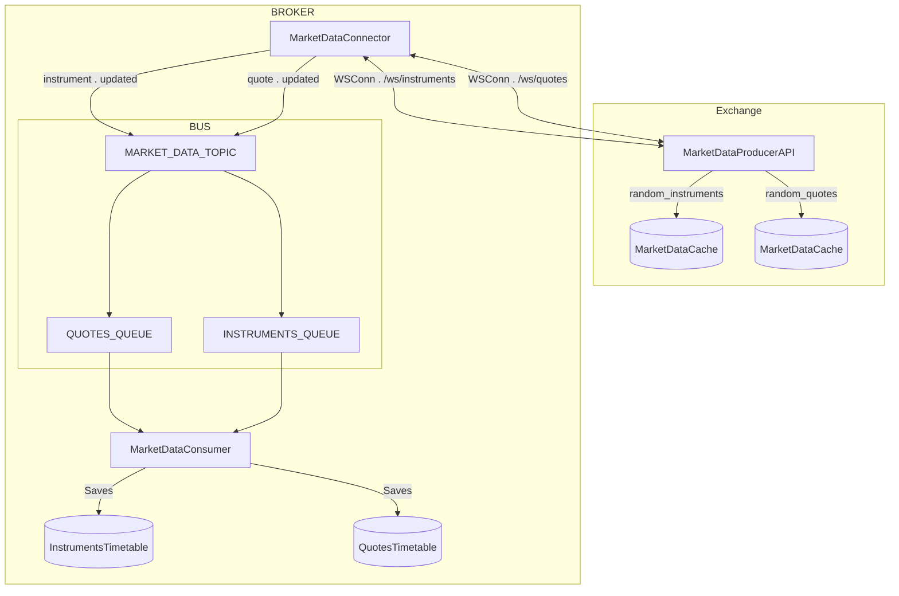
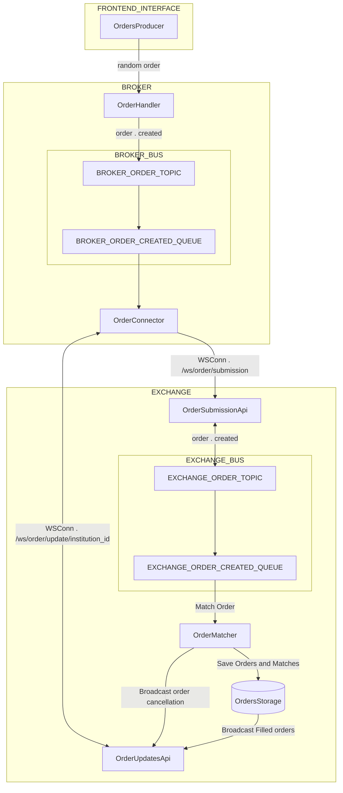

# Mini Broker

Simple/naive implementation of market data and order placing/matching happens in a exchange. The idea is create a high load in two systems.
1) The exchange system will create a high load of instrumetns and quotes that need to be consumed by it self and by the order broker
2) Broker generates a high load of ordes that are then matched in the exchange and and broadcast back to the borker

By putting the two systems under a high load we could experiment patterns or technologies to solve those problem at a low cost.





### Current status
The project is not completed and still need tuning. Some basic knowns to take in consideration are:
2) Better query tunning
3) Broker needs to finish the order updates part
4) Order cancellation in both sides
5) Internal bus implementation have issues to complete order fulfilled events

### Setup Infrastructure

```bash
docker compose -f development/docker-compose.yaml up &
```
