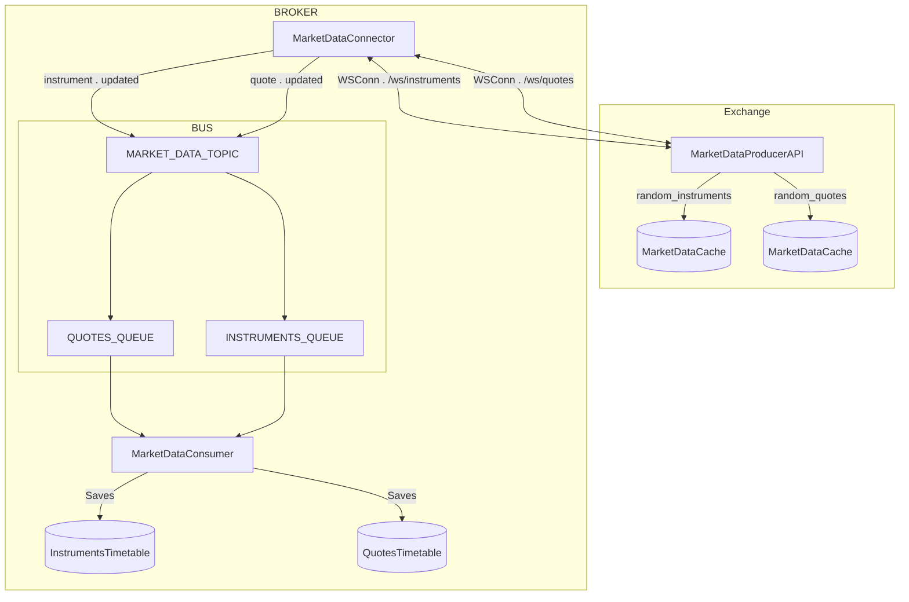
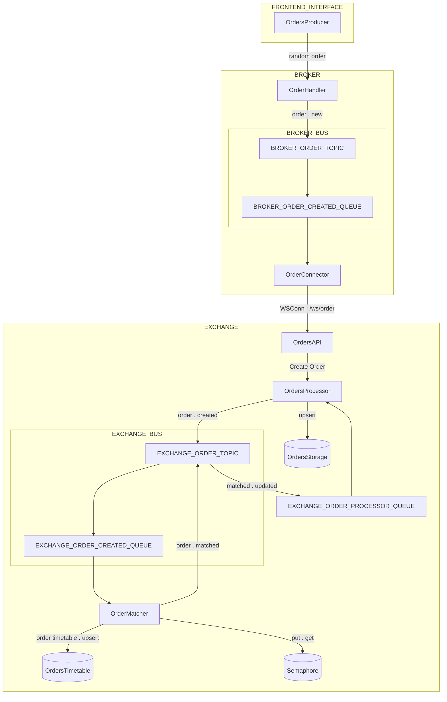

# Mini Broker

Simple/naive implementation of market data and order placing/matching in a exchange.


```mermaid
flowchart
    subgraph BUS
        MARKET_DATA_TOPIC
        INSTRUMENTS_QUEUE
        QUOTES_QUEUE
    end
    subgraph Exchange
        MarketDataProducerAPI
        InstrumentsCache
        QuotesCache
    end
    
    subgraph BROKER
        MarketDataConnector
        MarketDataConsumer
        InstrumentsTimetable
        QuotesTimetable
        BUS
    end 

    MarketDataProducerAPI -- random_instruments --> InstrumentsCache[(MarketDataCache)]
    MarketDataProducerAPI -- random_quotes --> QuotesCache[(MarketDataCache)]
    MarketDataConnector <-- WSConn . /ws/instruments --> MarketDataProducerAPI
    MarketDataConnector <-- WSConn . /ws/quotes --> MarketDataProducerAPI
    MarketDataConnector -- instrument . updated --> MARKET_DATA_TOPIC
    MarketDataConnector -- quote . updated --> MARKET_DATA_TOPIC
    MARKET_DATA_TOPIC ---> INSTRUMENTS_QUEUE
    MARKET_DATA_TOPIC ---> QUOTES_QUEUE
    QUOTES_QUEUE ---> MarketDataConsumer
    INSTRUMENTS_QUEUE ---> MarketDataConsumer
    MarketDataConsumer -- Saves --> InstrumentsTimetable[(InstrumentsTimetable)]
    MarketDataConsumer -- Saves --> QuotesTimetable[(QuotesTimetable)]
```


```mermaid
flowchart
    subgraph FRONTEND_INTERFACE
        OrdersProducer
    end
    subgraph BROKER
        OrderHandler
        OrderConnector
        BROKER_BUS
    end
    subgraph BROKER_BUS
        BROKER_ORDER_TOPIC
        BROKER_ORDER_CREATED_QUEUE
    end
    subgraph EXCHANGE_BUS
        EXCHANGE_ORDER_TOPIC
        EXCHANGE_ORDER_CREATED_QUEUE
    end
    subgraph EXCHANGE
        OrdersAPI
        OrdersProcessor
        EXCHANGE_BUS
        OrdersStorage
        OrderMatcher
        OrdersTimetable
%%        BuyMatrix
%%        SellMatrix
        Semaphore
        EXCHANGE_ORDER_PROCESSOR_QUEUE
    end

    OrdersProducer -- random order --> OrderHandler
    OrderHandler -- order . new --> BROKER_ORDER_TOPIC
    BROKER_ORDER_TOPIC ---> BROKER_ORDER_CREATED_QUEUE
    BROKER_ORDER_CREATED_QUEUE ---> OrderConnector
    OrderConnector -- WSConn . /ws/order --> OrdersAPI
    OrdersAPI -- Create Order --> OrdersProcessor
    OrdersProcessor -- upsert --> OrdersStorage[(OrdersStorage)]
    OrdersProcessor -- order . created --> EXCHANGE_ORDER_TOPIC
    EXCHANGE_ORDER_TOPIC ---> EXCHANGE_ORDER_CREATED_QUEUE
    EXCHANGE_ORDER_CREATED_QUEUE ---> OrderMatcher
    OrderMatcher -- order timetable . upsert --> OrdersTimetable[(OrdersTimetable)]
    OrderMatcher -- put . get --> Semaphore[(Semaphore)]
    OrderMatcher -- order . matched --> EXCHANGE_ORDER_TOPIC
    EXCHANGE_ORDER_TOPIC -- matched . updated --> EXCHANGE_ORDER_PROCESSOR_QUEUE
    EXCHANGE_ORDER_PROCESSOR_QUEUE ---> OrdersProcessor
```

### Setup Infrastructure

```bash
docker compose -f env/docker-compose.yaml up &
```